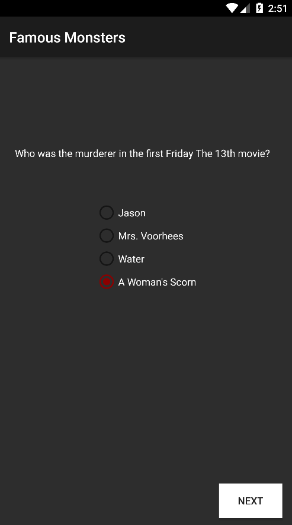

## Famous Monsters

### Synopsis
This is the third project in Udacity's Android Basics Nanodegree. For this project, I created a quiz that the user can play through and retrieve their score at the end. For this project I created a Quiz object to create my questions which were presented in different formats such as fill in the blank, multiple choice, and select all that apply. To accomplish this, I had to add additional logic to dynamically change the UI based off the type of question which was presented.

### Concepts and Technologies Used
- Java
- XML
- Working with nested layouts
- Handling and validating user input
- Handling button clicks
  - Implementing onClickListener
- Working with RadioGroup
- Working with CheckBox
- Object-Oriented Programming
- Android development best practices
    - sp for font size
    - dp for sizing
    - using xml files to reference strings instead of hardcoding

### Screenshot

